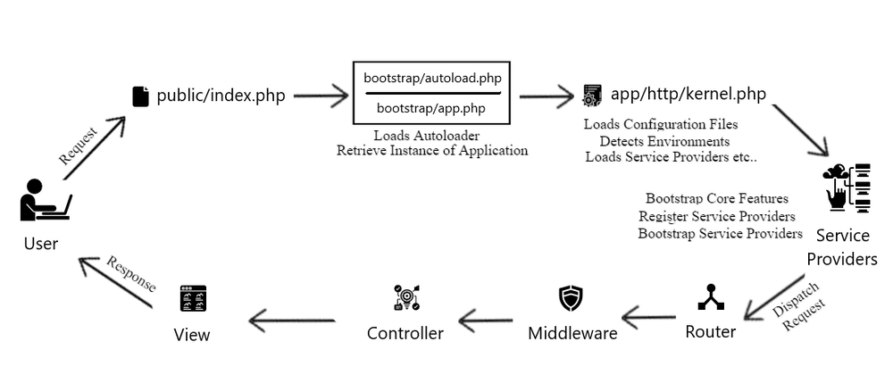

# Laravel Request Lifecycle

## 1.Application Entry Point
  - Requests enter through `public/index.php`. - It loads autoload & creates tha application instance.
  - **Note: What is an application instance?**
    - a copy of your laravel application. laravel start by creating an object that represent your app. this object is responsible for running everything in your app(routes, services, database and more). it's stored in a variable called `$app` and it's created inside the `bootstrap/app.php`.

## 2.Kernel
  - Laravel determines the request type(HTTP/Console) and sends it to the appropriate kernel. `We'll focus on the HTTP kernel`  Illuminate\Foundation\HTTP\Kernel - it runs `bootstrappers` to set up environment, logging, error handling, etc.
  - The method signature for the `HTTP kernel's handle method` is quite simple: it receives a Request and returns a Response. Think of the kernel as being a big black box that represents your entire application. Feed it HTTP requests and it will return HTTP responses.

## 3.Service Providers
  - They are the heart of the Laravel bootstrapping process - Laravel register all service providers before handling requests - Each provider calls `register()` first then `boot()` - They configure features like (DB, Auth, Routing, etc.)
  - **Note: What is a service container?**
    - It's like a `box of services` that laravel uses to store things your app might need like(database, connections or classes you use often)
    - Instead of creating objects yourself, Laravel gives them to you from this box
    - It helps keep your app organized and makes it easier to manage dependencies (things your classes need to work)
  - **Note: What's difference between `register()` and `boot()` in service providers?**
     - **register()**: Happens first. You use it to bind things into service container like(linking a name to a class)
     - **boot()**: Happens after all service providers are registered. You use it to run setup code when the app starts.

## 4.Routing
  - Router matches the request to a `route/controller`. - Executes any route-specific middleware.
  - If the request passes through all of the matched route's assigned middleware, the route or controller method will be executed and the response returned by the      route or controller method will be sent back through the route's chain of middleware.
  - Request goes through a stack of middleware (global or route-specific). - Middleware handles things like (sessions, CSRF, authentication, maintenance mode, etc)

## 5.Response Flow
  - Once the controller returns a response, it flows back through  middleware. - Then the `HTTP kernel's handle` method returns the response object to the `handleRequest` of the application instance, and this method calls the `send` method on the returned response to sends the response content to the user's web browser.

---

## The following imgae illustrates the Laravel Request Lifecycle:

